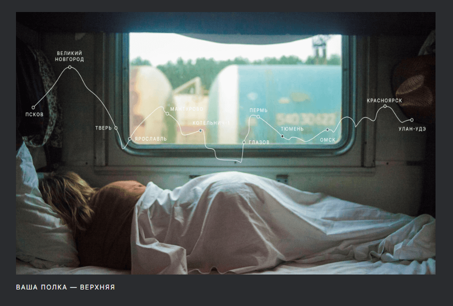

# Project: Travel Across Russia

This is a project from a [Yandex Practicum](https://practicum.yandex.ru/) web dev course. 

## Table of contents

## Overview

### Screenshot

### Links

- Link to Figma Sketch: [Figma Sketch online](https://www.figma.com/file/5S2WSbEFL6awjVWJ0NWL8Q/Sprint-3_-Russia-_-desktop-mobile?node-id=28503%3A0)
- Link to Live Site: [Github Pages](https://zang3tsu88.github.io/russian-travels/)

## My process

### Built with

- Semantic HTML5 markup
- CSS custom properties
- Flexbox
- Grid

### What I learned

Finnaly understood how exactly auto margin works. 
Practiced grid layout and got a hang of it.

### Useful resouces

Really good YT channel about CSS - [Kevin Powell YT Channel](https://www.youtube.com/@KevinPowell "Youtube Channel")

If you want more help with writing markdown, we'd recommend checking out [The Markdown Guide](https://www.markdownguide.org/) to learn more.

[Typograph](https://www.artlebedev.ru/typograf/) helps to put normal quotes (“Christmas trees” and “paws”) instead of inch signs, kill extra spaces, change hyphens to dashes in the right places, “attach” all short conjunctions and prepositions to the words following them with an inseparable space and produce a bunch other operations.

[TinyPNG](https://tinypng.com/) helps compress and optimize images.

## Author

- Github - [@zang3tsu88](https://github.com/zang3tsu88)

### Обзор
* Интро
* Figma
* Картинки

**Интро**

Здесь будет проект о путешествии по России.
В Фигме мы разместили макет, в котором видно, как проект должен выглядеть на самых распространённых разрешениях экранов.
Этот проект сложнее предыдущих, постарайтесь уделить ему больше времени.

**Figma**

* [Ссылка на макет в Figma](https://www.figma.com/file/5S2WSbEFL6awjVWJ0NWL8Q/Sprint-3_-Russia-_-desktop-mobile?node-id=28503%3A0)

**Картинки**

Доставать картинки предстоит из Фигмы. Это расхожая практика, поэтому полезно потренироваться.
Не забудьте [оптимизировать картинки](https://tinypng.com/), чтобы ваш сайт загружался быстрее.

Удачи!
